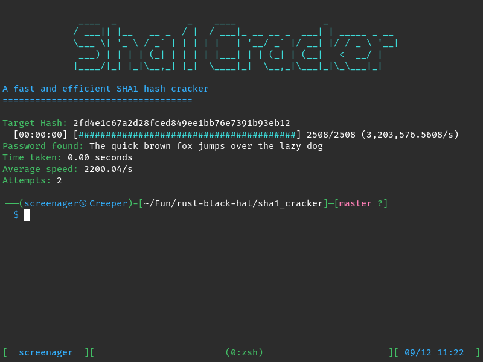

<h1>🔓 SHA1 Cracker</h1>
  
A simple SHA1 hash cracker written in Rust. Built as a learning project to practice Rust programming concepts.

## Features
- Dictionary-based SHA1 hash cracking
- Progress bar with real-time statistics
- Colored terminal output
